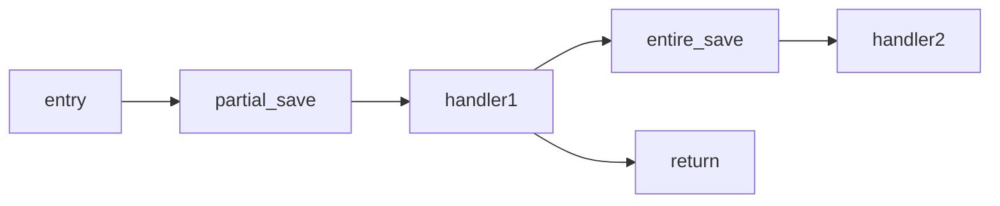

#### AsyncTrap 设计文档

##### 目标：提供快速的上下文切换，以及关于系统调用、中断、异常的异步路径

在产生中断、异常时，硬件在 `scause` 寄存器中保存了相关的原因。但从内核返回到用户态实际上是模拟中断、异常的形式，通过 `sret` 返回，这里没有在 `scause` 寄存器进行处理。
如果从内核返回用户态也通过 `scause` 寄存器进行判断，那么所有的突发或者自主的转移控制流的行为都可以通过 `AsyncTrap` 模块进行。

##### 突发控制流转移

突发控制流转移分为两类：收到中断或产生异常；根据被打断控制流所处的特权级，可以进一步分为下面三类。这几类情形，`RISC-V` 的机制是硬件将 `pc` 指针跳转到 `stvec` 寄存器指向的入口。进入到 `AsyncTrap` 后可以根据不同的情形，定制上下文保存。（rCore 中的做法是一股脑保存所有寄存器。） 

这里进行不同处理的依据是 `sstatus`、`scause` 寄存器中的信息。根据 `sstatus` 寄存器中的 `SPP` 位判断所处的特权级，根据 `scause` 来判断中断或异常。此外，还需要一个寄存器或者通过其他方式，获取当前正在执行的协程所处的状态，是否处于可让出点。（下面暂时用 `cstate` 寄存器来判断协程状态。这应该是编译器帮助我们隐藏的协程状态。）
- 在内核中收到中断（内核不产生异常）：`SPP` 位为 `Supervisor`，`scause` 寄存器为 `Trap::Interrupt`。无论是否需要抢占，AsyncTrap 都需要将对应的中断处理协程唤醒，以保证下一次能够根据优先级能够调度到中断处理协程。
  - 若需要抢占。此时，若 `cstate` 寄存器若表示当前协程处于不可让出点，则需要保存当前执行流的上下文，从内核的 `stack_pool` 中取出空闲栈，用于 `CPU` 继续执行，`PC` 将跳转到 `SharedScheduler` 的入口，调度下一个就绪的协程。若 `cstate` 寄存器表示当前处于可让出点，则不需要保存上下文，直接返回，调度下一个就绪协程。
  - 若不需要抢占，那么这里需要做的工作仅仅是唤醒中断处理协程即可，随后直接返回即可。不需要根据 `cstate` 寄存器的状态区别处理。
- 用户态收到中断：
  - 若为用户态中断，则与上述内核的处理相同。此时不能读取 `Supervisor` 模式下的 `CSR` 寄存器，所以这里还需要额外的判断条件。
  - 若收到的是发给内核的中断，则 `SPP` 位为 `User`，`scause` 寄存器为 `Trap::Interrupt`。`AsyncTrap` 根据这两个寄存器提供的信息向内核发送消息，唤醒对应的中断处理协程。后续的处理将根据中断是否需要抢占进行处理。若中断需要抢占，则保存当前用户态执行的上下文信息，回到内核执行中断处理协程；若不需要抢占，则直接返回用户态即可。
- 用户态产生异常：`SPP` 位为 `User`，`scause` 寄存器为 `Trap::Exception`。与用户态收到发给内核的中断相似，`AsyncTrap` 根据这两个寄存器提供的信息向内核发送消息，唤醒对应的异常处理协程。但为了利用多处理器的优势，这里直接返回到用户态，让其他的核来执行异常处理协程。

上面的描述并没有涉及原本执行流被抢占时，上下文保存的位置。在这里直接将上下文保存在对应的协程控制块的上下文字段中（不是 `core::task::Context`，是自定义的字段）。具体可见 [用户进程任务控制块](./design-v2.md#用户进程任务控制块)

##### 自主控制流转移

自主控制流转移只有进程从内核返回到用户态。这里需要在内核中实现向 `sstatus` 寄存器 `SPP` 位写 `User`，向 `scause` 写原因（目前没有定义），并且向 `sepc` 写 `SharedScheduler` 入口地址，最后通过跳转指令跳转到 `AsyncTrap` 的入口，至此才算完成模拟进入 `AsyncTrap` 的入口。

这里需要保存内核执行流的线程，因为内核中都是函数调用，即便是使用 `naked_function` 或者 `core::arch::asm`，那么这些情况对于其他的寄存器的使用是显式的，因此内核上下文的保存只需要保存 `ra` 和 `s0 ~ s11` 这部分寄存器。

保存了内核执行流现场后，`AsyncTrap` 只需要从用户态的栈中恢复上下文即可进入用户态执行。

##### 处理流程

大致思路与 FastTrap 相同，但不同的是对于被抢占的栈的处理。我的理解是 FastTrap 没有对 Stack 的归属进行明确的划分，我这里的做法是将被抢占的栈归属于被打断的协程，转化为线程。

##### 挑战

所有的这些操作都必须不使用栈，给代码编写上会带来一点麻烦。尤其是设计中断的部分，需要从 `PLIC` 中获取中断信息，目前 `PLIC` 库的实现是用 `Rust` 语言编写的封装对底层寄存器的访问，不能严格保证这些 `Rust` 代码不使用栈。