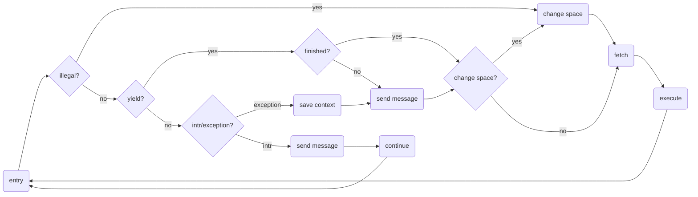
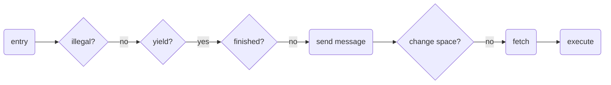
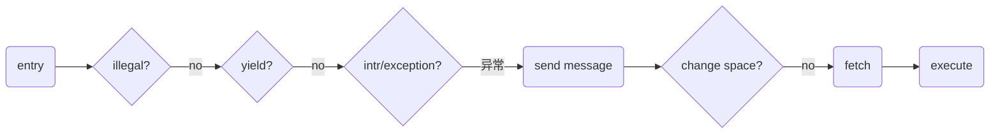
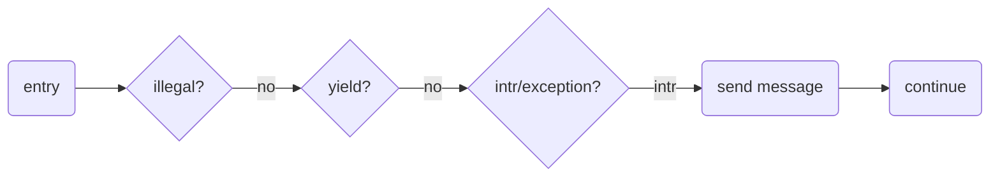

### 软硬件结合的共享调度器设计方案  v3

时间：2023年11月19


进程、线程都以协程的形式实现，需要做的事情就是：

- [ ] 管理协程
- [ ] 切换协程
- [x] 运行协程


#### 运行协程

让协程运行起来需要做的事情为：

 - `a0` 寄存器设置为堆中的任务指针
 - `pc` 寄存器设置为执行函数 `execute`
 - `ra` 寄存器设置成 `entry`
 - `sp` 设置为空的栈顶

将 `sp` 设置成空栈顶，因为协程运行前，栈上没有相应的上下文需要恢复，但需要准备一个栈供 `execute` 函数使用。协程上下文恢复的过程都在 `execute` 函数之后。

1. `await` 导致的主动让权：跨越 `await` 的上下文会从堆中恢复，由编译器来帮助完成。
2. 在不可让出点被打断：上下文将保存在运行的栈上，需要在 `User-implemented future (impl Future for Task)`^[[CAT: Context Aware Tracing for Rust Asynchronous Programs](https://dl.acm.org/doi/10.1145/3555776.3577669)] 中通过汇编代码恢复上一次被打断的上下文。

```rust
pub struct Task {
    pub context: Option<Context>,
    ......
}

impl Future for Task {
    fn poll(self: Pin<&mut Self>, _cx: &mut Context<'_>) -> Poll<Self::Output> {
        if self.context.is_some() {
            // 存在上下文，表示这个协程上一次被抢占，需要恢复上下文（手写汇编代码），
            // 这个协程执行过程中，栈将切换到被打断的状态，为线程切换
        } else {
            // 没有手动保存的上下文，表示这个协程初次运行或者上一次是主动让权，
            // 所需要的上下文在执行起来后从堆中恢复，编译器帮助完成
        }
    }
}
```

一旦需要在 `poll` 函数中手动恢复上下文，那么这个协程与上一个协程运行在不同的栈上，这一次切换为线程切换。

以下为协程执行函数 `execute` 示例，若协程执行完毕，则利用所有权机制直接释放；若阻塞，则需要阻止释放。

```rust
pub fn main() {
  let task = Task::new(......);
  let raw_task = Arc::into_raw(task.clone()) as usize;
  core::arch::asm!(
      "jalr t0",
      in("a0") raw_task,
      in("t0") exec_fn,
  );
}

pub fn execute(task: *const Task) {
    unsafe {
        let task = Arc::from_raw(task);
        let waker = waker::from_task(task.clone());
        let mut cx = Context::from_waker(&waker);
        let fut = &mut *task.fut.as_ptr();
        let mut future = Pin::new_unchecked(fut.as_mut());
        match future.as_mut().poll(&mut cx) {
            Poll::Ready(_) => {},
            Poll::Pending => {
                let _ = Arc::into_raw(task);
            },
        }
    }
}
```

#### 管理协程

协程控制块由 `Executor` 管理。每个进程（内核也是进程）中维护一个 `Executor` 结构，管理本地址空间中存在的协程。

1. 协程控制块通过 `Arc` 指针保存在堆中，其占用的空间由堆分配器分配。堆中占用空间的释放由所有权机制保证。见协程执行函数 `execute` 示例。 
2. `Executor` 中以优先级队列的形式维护协程控制块在堆中的实际地址 `*const Task`。

`Executor` 保存在物理内存中。将其首地址保存在硬件的寄存器中（暂时称之为 `Executor` 寄存器）。参考日志文件系统的设计，一种可能的管理方案如下。一些 `Executor` 元数据信息保存在头部（header block），而协程的指针保存在尾部（data block）。软件代码和硬件都可以操作 `Executor` 结构。

```
// Executor
+------------- +------------+------------+--------+------------+
| header block | data block | data block | ...... | data block |
+------------- +------------+------------+--------+------------+

// header block
+---------------------+-----------------+----------------+
| Kernel Executor ptr | Priority Bitmap | Queue Metadata |
+---------------------+-----------------+----------------+

```

`Executor` 元数据中需要维护内核 `Executor` 指针，保证在需要陷入内核时，硬件能够选择出内核的下一个就绪协程。（具体的陷入内核还需要进一步考虑实现细节）。


#### 切换协程

进程切换、线程切换、协程切换取决于选出的下一个就绪协程与上一个协程之间的关系。

根据不同的原因确定确定切换对象。

怎么切换地址空间？需要修改 `Executor` 和 `satp` 寄存器

- 在 `change space` 判断阶段判断出需要切换地址空间后，硬件帮助完成 `Executor` 寄存器和 `satp` 寄存器修改。
- 硬件取出新进程中的就绪协程后，需要从 `Executor` 中取出一个空闲栈，供 `execute` 函数使用。

怎么完成线程切换？

- 在判断为异常，当前的上下文需要保存时，上下文保存在栈中，并与被打断的协程绑定。同上，取出线程后，从栈池中取出空闲栈。

#### 模块设计图




#### 完全异步路径：

将中断、异常看作一种消息事件。在用户态发生时，给用户进程和内核分别发送一个消息；
在内核态发生时，给内核发送消息。

不同行为的处理路径
1. 异步系统调用：调用异步系统调用的协程阻塞，其他协程可以继续运行

2. 异常：产生异常的协程阻塞，其他协程可以继续运行

3. 中断：虽然执行流会被打断，但寄存器现场不会改变，硬件给内核发送中断消息


这里的消息为三种类型：
1. 系统调用消息：根据系统调用编号，从预先注册的系统调用表中找到对应的系统调用协程指针，发送给内核 `Executor`
2. 中断/异常消息：根据 irq 或 trap 类型，从预先注册的处理协程表中找到对应的协程任务指针，发送给内核的 `Executor`


