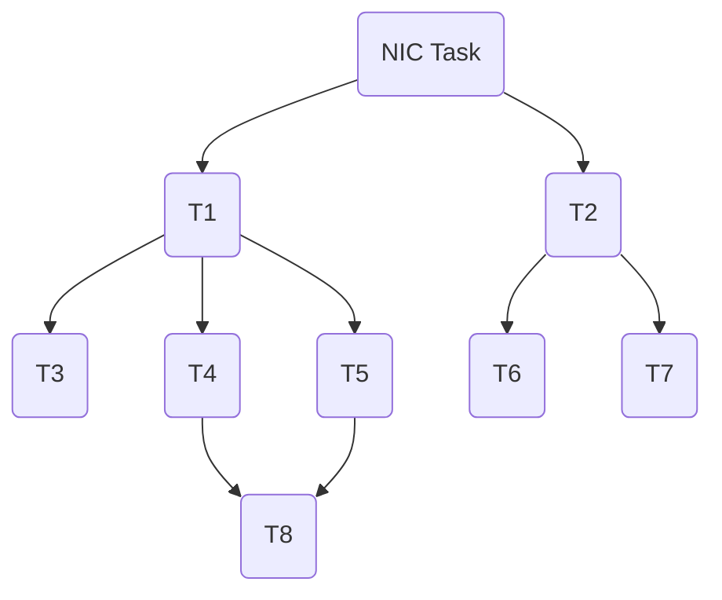

### 基于协程的任务调度器设计方案 v5

时间：2023年12月22

目标：在保证隔离性的前提下，构建高吞吐量、低时延的服务

核心思路：使用硬件帮助唤醒阻塞的任务
  1. 硬件处理中断前半段
  2. 硬件转发系统调用

模块：

- [X] 任务调度
- [X] 任务唤醒
- [X] 系统调用转发


#### 任务调度

##### 任务分析

系统中只有进程、协程两个概念。进程用于资源分配与保证隔离性，而协程则表示具体的任务。任务之间的控制流转移都将以协作的形式进行，中断由硬件处理，不会打断正在执行的控制流；且基于现代的处理器，CPU 数量和可用的物理内存不再受到限制，不再需要时钟中断以及一些与页面相关的异常处理（其他的异常则直接将对应的进程杀死）实现多道程序复用。因此，==系统中没有线程的概念==。


##### 任务控制块

进程、协程均实现 `Future trait`（以下简称为 `fut`），从而可以由任务控制块（`Task`）数据结构描述。`Task` 及其内部的 `fut` 均保存在堆中，由 Rust 所有权机制进行维护，保证内存安全。

```Rust
#[repr(C)]
pub struct Task {
    pub(crate) executor: &'static Executor,
    /// The task state field
    pub state: AtomicU32,
    /// The priority of task
    pub priority: AtomicU32,
    /// The task type field:
    ///     1. Normal
    ///     2. AsyncSyscall
    ///     3. ......
    pub task_type: TaskType,
    /// The actual content of a task.
    /// It may be a `process`, `thread` or `coroutine`.
    pub fut: AtomicCell<Pin<Box<dyn Future<Output=isize> + 'static + Send + Sync>>>,
}
```

`Task` 由 `Executor` 维护，其内部的就绪队列中维护 `TaskRef`（`Task` 指针）。

```Rust
#[repr(transparent)]
#[derive(Debug, Clone, Copy, PartialEq, Eq, PartialOrd, Ord, Hash)]
pub struct TaskRef {
    ptr: NonNull<Task>,
}
```

##### 任务切换

调度器的调度对象为 `Task`。由于 Rust 将 `fut` 实现为有限状态机，将其运行所需要的上下文（包括手动保存的和编译器帮助保存的部分）保存在一块不能移动的内存中，在运行过程中恢复上下文，而当前的运行栈不保存所需要的上下文。因此，让一个 `Task`（`fut`） 恢复执行需要完成以下工作：

1. 调度一个处于就绪状态的 `Task`；
2. 准备好运行栈；

上述两个工作可以 `由硬件实现的任务调度器`（以下简称 `任务调度器`）帮助完成。完成上述两个工作后，运行函数 `execute` 将会让 `Task` 从暂停点恢复执行。

```Rust
pub fn execute(task_ref: TaskRef) -> Option<TaskRef> {
    unsafe {
        let waker = waker::from_task(task_ref);
        let mut cx = Context::from_waker(&waker);
        let task = Task::from_ref(task_ref);
        task.state.store(TaskState::Running as _, Ordering::Relaxed);
        let fut = &mut *task.fut.as_ptr();
        let mut future = Pin::new_unchecked(fut.as_mut());
        match future.as_mut().poll(&mut cx) {
            Poll::Ready(_) => { ...... },
            Poll::Pending => { ...... },
        }
    }
}
```

###### 如何运行新进程

主核在初始化之后，维护 `cpu_set` 数据结构来管理系统可用的核心。当主核（简称 `M`）从 `任务调度器` 中获取到进程对应的 `fut` 且执行时，这个 `fut` 通过 ipi 唤醒其他处于休眠状态的核心（简称 `S`），`S` 将并行的执行进程。

当 `S` 被唤醒进入到 `Supervisor` 特权级后，它从参数中获取到对应的进程地址空间、入口等信息，再切换到 `User` 特权级。


##### 任务调度

使用协程作为任务单元，只能使用协作式调度，这不利于构建低时延服务。假设处理器正在运行某项耗时较长的协程，此时产生了一个需要快速响应的请求，但由于协作式调度的原因，不能及时的响应，这导致响应时延边长。在这种情况下，需要抢占才能够保证响应时延。最直接的方式是通过中断实现抢占，但这将会导致过多的上下文切换开销。还有一些其他的方式实现抢占，例如编译器插桩，这可以实现抢占式调度相接近的效果。在这里，我们可以参考这种方式，用协作式调度来近似抢占式调度。

我们在 `Task` 结构中维护优先级，调度器将根据优先级进行调度，每当产生一个新的请求时，创建或唤醒具有最高优先级的 `Task`，保证下一次能够调度到这个 `Task`。并且我们通过限制每个 `Task` 不会占用过长时间（过长的计算任务进行拆分，耗时的 IO 任务转化成异步的形式）。通过上述的方式实现近似的抢占式调度。

#### 任务唤醒

`Task` 以及 `fut` 占用的空间都保存在堆中，且在进入 `execute` 函数之前不需要恢复 `fut` 的上下文。因此，调度器里需要维护的对象是 `TaskRef`（8 字节），将目标 `Task` 对应的 `TaskRef` 添加到调度器的就绪队列中这个过程即被视为任务唤醒。

如何确定任务唤醒的时机，目前主要存在以下几种方式：

1. 中断
2. 轮询
3. 混合中断轮询模式

利用中断来进行唤醒，但由于中断时机不确定，可能在 `fut` 执行过程中产生中断，这时必须保存通用寄存器等上下文，这将会产生大量的开销；若利用单独的 `fut` 进行轮询，那么，这个 `fut` 在负载高的情况下，必须单独占用一个处理器核，它将退化为线程，产生资源浪费，且上述的使用协作式调度拟合抢占式调度也不能达到应有的效果，必须将这个 `Task` 进行单独处理。

由于上述任务唤醒的过程被简化了，该过程可以由硬件电路来帮助完成。因此，我们将中断处理唤醒任务的过程从 `CPU` 卸载到 `任务调度器` 上。以网卡设备为例，当它接收到数据包后，它产生的中断信号通过电路传递给 `任务调度器`，`任务调度器` 从中断向量表中读取到对应的 `TaskRef`，将 `TaskRef` 添加到 `Executor` 内的就绪队列。

###### 任务唤醒森林：



根任务由 `任务调度器` 唤醒，而其余任务则由对应依赖关系的父任务唤醒。父任务把子任务对应的 `TaskRef` 添加到子任务所在的地址空间对应的 `任务调度器` 即视为唤醒子任务。


#### 系统调用转发

在 `Task` 执行期间，大多数上下文切换是由于系统调用造成的。此外，如果 `Task` 阻塞在同步的系统调用上时，那么这个 `Task` 也将退化成线程，其他的就绪 `Task` 无法在当前的栈上运行。因此需要通过系统调用转化将同步系统调用改造成异步系统调用，同时减少由系统调用导致的上下文切换开销。

这里不涉及由中断、异常导致的上下文切换优化，一方面，因为中断已经被 `任务调度器` 代理；另一方面，在现代的设备上，可用的物理内存不再受限，产生缺页异常的概率较小，而其他的异常处理可以直接将进程杀死。

同上任务唤醒中的描述相似，若通过共享内存进行系统调用转发，同样需要单独的 `fut` 轮询共享内存。为此，我们将通过 `任务调度器` 转发系统调用。通过将系统调用的参数写入 `任务调度器` 的寄存器中，向处在另一个处理器核心上的内核转发系统调用，唤醒对应的系统调用处理 `Task`。

系统调用消息中除了本身的参数外，还需要 `process info pointer` 和 `related user task_ref`，因为内核在处理系统调用时，涉及到目标进程的相关信息，必要时，还需要唤醒对应的用户态 `Task`。具体格式如下（128 字节，`arguments` 占 64 字节，`process info pointer` 和 `related user task_ref` 各占 8 字节，系统调用处理结果占 48 字节，可以支持返回更多的结果）：

```rust
high                                                                   low
+----------------------+-----------------------+-----------+-------------+
| process info pointer | related user task_ref | arguments | syscall res |
+----------------------+-----------------------+-----------+-------------+
```

用户进程通过写 `任务调度器` 的寄存器传递系统调用参数，`任务调度器` 将返回对应的系统调用条目在系统调用表中的下标。而后系统调用协程将会被阻塞，当内核处理完系统调用后，通过写寄存器将结果写入到对应的系统调用条目中，并将对应的系统调用协程的 `TaskRef` 添加至对应的就绪队列中。系统调用协程下次被调度时将从下标对应的条目中获取系统调用结果。

#### 注意

由于中断处理例程和系统调用处理例程都被转化为有状态的协程，而不再是无状态的代码，因此为了避免冲突，需要配备与内核使用的核心数量相等的中断/系统调用处理协程。


#### 存在问题

由于 `Executor` 集成在硬件里，这限制了最大支持的数量，因此需要考虑用内存做缓存，当硬件可管理的任务数量达到上限时，将会读写内存。内存中为全局队列，而硬件内的 `Executor` 为局部队列。


