# 基于协程的异步任务控制器（ATS-INTC）设计方案

时间：2023年12月28

ATS-INTC：异步任务 调度（ATS） + 外部中断处理（INTC） + 系统调用（IPC）

模块：

- [x] 任务调度
- [x] 任务唤醒
- [x] IPC
- [x] 内存缓存


### 任务调度

任务用统一的 `Task` 数据结构描述，包括进程、线程、协程三类，各自的行为取决于其如何实现 `Future trait`（简称为 `fut`）。

`ATS-INTC` 只负责任务调度，给软件提供其内部维护的优先级最高的就绪任务。而具体的进程、线程和协程切换（上下文保存与恢复）都在软件中完成。

调度的对象是任务的裸指针（简称 `TaskRef`）。任务（`Arc<Task>`）由软件进行创建，其内存分配在堆中，由 `Rust` 所有权机制保证内存安全。

- 软件创建任务后，将 `TaskRef` 通过写寄存器交给 `ATS-INTC` 中的优先级调度器（简称 `PScheduler`）管理。
- 软件从 `ATS-INTC` 中取出 `TaskRef` 后，在软件中转化成 `Arc<Task>`，任务执行结束后，占用的空间将被释放。

调度以进程为边界，`ATS-INTC` 内存在多个 `PScheduler`，一个 `PScheduler` 负责一个进程地址空间内的任务调度。`PScheduler` 内维护多个优先级队列，每次从最高优先级的队列中取出 `TaskRef`。



```Rust
#[repr(C)]
pub struct Task {
    /// The task state field
    pub state: AtomicU32,
    /// The priority of task
    pub priority: AtomicU32,
    /// The task type field:
    ///     1. Normal
    ///     2. AsyncSyscall
    ///     3. ......
    pub task_type: TaskType,
    /// The actual content of a task.
    /// It may be a `process`, `thread` or `coroutine`.
    pub fut: AtomicCell<Pin<Box<dyn Future<Output=isize> + 'static + Send + Sync>>>,
}

#[repr(transparent)]
#[derive(Debug, Clone, Copy, PartialEq, Eq, PartialOrd, Ord, Hash)]
pub struct TaskRef {
    ptr: NonNull<Task>,
}
```

相较于软件而言，`ATS-INTC` 被动的准备好就绪协程，等待软件获取。软件中采取协作式调度，只能等待当前的任务执行完毕后才能运行下一个任务，这不利于构建低时延服务（假设处理器正在运行某项耗时较长的任务，此时产生了一个需要快速响应的请求，但由于协作式调度的原因，不能及时的响应，这导致响应时延变长）。需要抢占才能够保证响应时延。最直接的方式是通过中断实现抢占，但这将会导致过多的上下文切换开销。还有一些其他的方式实现抢占，例如编译器插桩，这可以实现抢占式调度相接近的效果。在这里，我们可以参考这种方式，用协作式调度来近似抢占式调度。

在 `Task` 结构中维护优先级，`ATS-INTC` 根据优先级进行调度，每当产生一个新的请求时，创建或唤醒具有最高优先级的 `Task`，保证下一次能够调度到这个 `Task`。并且通过限制每个 `Task` 不会占用过长时间（过长的计算任务进行拆分，耗时的 IO 任务转化成异步的形式）。通过上述的方式达到近似抢占式调度的效果。

> **注意**：当存在多个可用核心时，在运行进程时，可以通过 ipi 将进程运行在其他的核心上，当只有一个核心时，只能在当前核上进行。硬件将中断处理/系统调用处理协程添加到内核对应的 `PScheduler` 中，那么这个核心何时从用户态切换到内核态？硬件检测到没有核处于内核态时（维护 `PScheduler` 的状态），就发起一个中断（与共享调度器在时钟中断时维护全局优先级位图类似，维护全局优先级位图转化为维护全局 `PScheduler` 状态）。

==这里在 `ATS-INTC` 中维护 `PScheduler` 保证硬件能够感知软件中的协程。操作系统通过访问硬件来感知用户进程的协程。==

### 任务唤醒

如何确定任务唤醒的时机，目前主要存在以下几种方式：
1. 中断
2. 轮询
3. 混合中断轮询模式

利用中断来进行唤醒，但由于中断时机不确定，可能在 `fut` 执行过程中产生中断，这时必须保存通用寄存器等上下文，这将会产生大量的开销；若利用单独的 `fut` 进行轮询，那么，这个 `fut` 在负载高的情况下，必须单独占用一个处理器核，它将退化为线程，产生资源浪费，且上述的使用协作式调度拟合抢占式调度也不能达到应有的效果，必须将这个 `Task` 进行单独处理。基于上述的分析，需要将唤醒任务卸载到硬件上，不能交给软件进行。

`ATS-INTC` 的定位是 `UINTC` 的扩展。`UINTC` 中维护接收方状态表，发送方发送 `uipi` 后，接收方的执行流将被打断，在中断处理例程内唤醒对应的任务。这个过程完全由 CPU 来进行。想要将这个过程卸载到 `ATS-INTC` 中，则必须在其中维护 `PScheduler` 及其状态（`PScheduler Table`），`ATS-INTC` 才能唤醒中断处理协程（将中断处理协程添加到 `PScheduler`），等当前任务执行让权后，将会执行中断处理协程，消除了 `UINTC` 的中断抢占开销。

###### 任务唤醒示例：


以进程执行 `accept`、`listen` 系统调用为例，（系统调用转化为 `ipc`，用户进程为发送方，内核作为接收方）。
1. 用户协程内部调用 `accept`、`listen` 系统调用协程。它们作为一个整体的被阻塞的协程。
2. 内核的系统调用处理协程发现没有建立 `socket` 连接时，`accept`、 `listen` 系统调用协程把自己对应的 `waker` 注册到网络协议栈更新 `socket` 状态协程的回调函数中，而这个更新 `socket` 状态协程将会被阻塞在 `ATS-INTC` 的网卡阻塞协程队列中。
3. 当 `ATS-INTC` 处理来自网卡的中断后，它将唤醒更新 `socket` 状态协程，这个协程从网卡中读取网络包并更新 `socket` 状态。一旦 `accept`、`listen` 系统调用处理协程对应的 `socket` 状态发生变化，`accept`、`listen` 系统调用处理协程将会被唤醒，再唤醒用户态的任务。

最后阻塞在网卡上的协程是没有优先级可以区分的，硬件一旦处理网卡中断，就会将这些协程唤醒，放入到最高优先级的队列中。这个 `accept` 和 `listen` 系统调用可以是同一进程内没有依赖关系的两个任务，也可以是不同进程内的任务。

### IPC 加速

由于 `KPTI` 机制，内核与进程采用不同的页表，可视为对等的个体。将内核与普通的用户进程分别运行在不同的核心上，将系统调用转化为 `IPC`，利用上述的任务唤醒机制，从而实现加速 IPC（系统调用）的效果。

`IPC` 消息格式：

`IPC` 消息中除了本身的参数外，还需要 `process info pointer` 和 `related user task_ref`，因为内核在处理系统调用时，涉及到目标进程的相关信息，还需要唤醒对应的用户态 `Task`。具体格式如下（128 字节，`process info pointer` 和 `related user task_ref` 各占 8 字节，`ipc type` 占 8 字节，`arguments` 占 64 字节，`IPC res` 占 40 字节）：

```rust
high                                                               low
+----------------------+-----------------------+----------+-----------+---------+
| process info pointer | related user task_ref | ipc type | arguments | ipc res |
+----------------------+-----------------------+----------+-----------+---------+
```

不需要设置 `status` 字段，因为针对这个 IPC 消息条目的操作只有相关的协程被唤醒后才会进行读写。


### 内存缓存

由于在 `ATS-INTC` 中维护 `PScheduler`，一方面限制了 `PScheduler` 的数量（只有与可用核心数量相等的 `PScheduler`），若存在的进程数量大于可用核心数量，则这些进程对应的 `PScheduler` 只能缓存到内存中。另一方面，每个 `PScheduler` 中可维护的 `TaskRef` 数量也受到限制，目前先不考虑这部分的缓存机制，因为每个 `TaskRef` 只有 8 字节，暂定每个 `PScheduler` 中维护 7 个优先级队列，一个处理协程表（接收方注册的处理协程），每个队列/表的容量为 128，总共占用的空间为 8K，每个进程最大程度可支持 1K 个协程。

在每次进程切换时，需要将上一个进程使用的 `PScheduler` 中的内容刷新到内存中，将下一个进程需要的信息从内存中加载到 `PScheduler` 中。

### 系统架构图



### 软硬件行为

#### 单核

1. 系统启动后，完成 console、heap、mm 等模块初始化后，开始对 `ATS-INTC` 进行初始化。

2. `ATS-INTC` 初始化：
   1. 软件写 `control` 寄存器中的 `reset` 位（`ATS-INTC` 将内部的 `IPC Table`、`PScheduler Table` 以及所有 `PScheduler` 清空）。软件等待 `control` 寄存器中 `reset` 位清零。
   
   2. 软件写 `ext_handler` 寄存器向 `ATS-INTC` 中的 `Ext Intr Dispatcher` 注册外部中断处理协程，写 `control` 寄存器中的 `ext_handler` 位，等待 `ext_handler` 位清零。
   
   3. 软件写 `ipc_handler` 寄存器向 `ATS-INTC` 中的 `IPC Dispatcher` 注册 IPC 处理协程，写 `control` 寄存器中的 `ipc_handler` 位，等待 `ipc_handler` 位清零。
   
   4. 软件写 `pid` 和 `memcache` 寄存器向 `ATS-INTC` 中的 `PScheduler Table` 注册内核的缓存，写 `control` 寄存器中的 `memcache` 位，等待 `memcache` 位清零。 
   
3. 软件初始化第一个进程 `INIT_TASK`，并向 `ATS-INTC` 的 `stask` 寄存器写对应的 `TaskRef` 寄存器，写 `pid` 寄存器，写 `control` 寄存器中的 `stask` 位，等待 `stask` 位清零。
   1. 初始化进程 `Task` 时，需要写 `pid` 和 `memcache` 寄存器向 `ATS-INTC` 中的 `PScheduler Table` 注册进程的缓存，写 `control` 寄存器中的 `memcache` 位，等待 `memcache` 位清零。
   
4. 软件写 `ATS-INTC` 的 `control` 寄存器中的 `ftask` 位，等待清零。随后从 `ftask` 寄存器中读取目标 `TaskRef`。

5. 软件将 `TaskRef` 转化为 `Arc<Task>`，使用 `poll` 函数执行任务。
   
6. 若任务为进程，则在 `poll` 函数中跳转到 `trampoline` 进入用户地址空间。`poll` 函数内部行为：
   1. 软件写 `ATS-INTC` 中的 `pid` 寄存器（内容为内核的 pid），写 `control` 寄存器中的 `flush_proc` 位，将内核目前使用的 `PScheduler` 内容刷新到对应的内存缓存中，并更新 `PScheduler Table` 中的状态。
   
   2. 软件写 `ATS-INTC` 中的 `pid` 寄存器（内容为目标进程的 pid），写 `control` 寄存器中的 `sync_proc` 位，将内存中对应的缓存加载到 `PScheduler` 中。（若进程为初始化后第一次执行，这个操作可以省略。）

7. 用户态的执行与内核的行为类似，创建协程通过写 `stask` 寄存器、`pid` 寄存器和 `control` 寄存器中的 `stask` 位。取出协程通过写 `control` 寄存器中的 `ftask` 位。

8. 若用户态的执行流被打断（异常、时钟中断），通过 `trampoline` 进入到内核后，回到原来进程 `poll` 函数的执行流，若为异常，则会创建一个异常处理协程。若为时钟中断，则不做处理，返回上一层函数调用，取出下一个就绪的任务。
   1. 同进入用户态相同，需要将当前进程使用的 `PScheduler` 刷新到内存中，并切换回内核的 `PScheduler`，再创建内核异常处理协程。

9.  若用户程序执行系统调用，则写 `ATS-INTC` 的 `args` 寄存器、`ipc_type` 寄存器、`ipc_task` 寄存器，以及 `control` 寄存器中的 `ipc` 位，等待 `ipc` 寄存器清零，从 `ipc_idx` 寄存器中获取对应的消息在 `IPC Table` 中的下标。下次被唤醒后，将根据下标从对应的 `IPC` 消息中获取结果。
    1. `IPC Dispatcher` 将根据 `IPC` 消息的类型，进行转发。若为系统调用，此时检测到 `PScheduler Table` 中内核对应的 `PScheduler` 不在线，需要先从内存中读取出一个系统调用处理协程 `TaskRef`，再将这个 `TaskRef` 写入到内存中的就绪队列。
    
    2. 若用户态没有就绪的协程时，则主动让权；或者由于时钟中断切换回内核；

10. 若为用户进程之间的 `IPC`，这里只需要注册接收方。若没有接收方，发送方发起 `IPC` 将会返回错误；
    - 接收方注册流程：1）同 3 所述流程。

    - 发送方发送：1）同 9，软件先在 `IPC Table` 中创建一个消息条目（其中的参数可以是共享内存的地址等，具体的规范还未考虑）。2）`IPC Dispatcher` 根据接收方的 `pid`（这个消息必须包含在 `IPC` 消息条目中，发送方是可以直接获取这个信息的） 参数，从 `PScheduler Table` 中查找对应的状态，不在线，则先从内存中读出处理协程 `TaskRef`，在将其写入到内存的就绪队列中。

    - 接收方处理流程（内核的系统调用处理协程、普通接收方进程处理协程）：协程内写 `ipc type` 寄存器、`pid` 寄存器和 `control` 寄存器中的 `fipc` 位，等待 `control` 寄存器中的 `fipc` 位清零。随后从 `ipc_idx` 寄存器中读取下标，从 `args` 寄存器中读取 `IPC` 消息条目的具体内容。根据这些信息完成处理后，将处理结果写入到 `ipc_res` 寄存器，写 `control` 寄存器中的 `ipc_res` 位，等待其清零。随后与创建协程类似，将传递的 `related user task_ref` 写入到目标的进程的 `PScheduler` 中，唤醒对应的发送方协程。（内核外部中断处理协程与这个过程类似，但处理的参数都在内核中维护，不需要从 `ATS-INTC` 中获取）


> **注意**：上述的行为只是在单个核心，`ATS-INTC` 中只存在单个可用的 `PScheduler` 的情形。若 `ATS-INTC` 中存在多个可用的 `PScheduler`，则可以省略部分内存读写操作。但当进程数量超过可用 `PScheduler` 数量时，仍然存在内存读写。
>

#### 多核

与上述单核相似，但只有在核心不够用时，才会产生在单个核上多道程序复用的情况。

通过在内核（软件）中维护 `cpu_set`，进行灵活的核心分配策略，保证在核心数够用时，有至少一个核专门运行在内核态，从而实现 `IPC` 加速的效果。


#### 上述方案的缺点

系统中最大的进程数量受限于 `PScheduler Table` 中的条目的数量。


