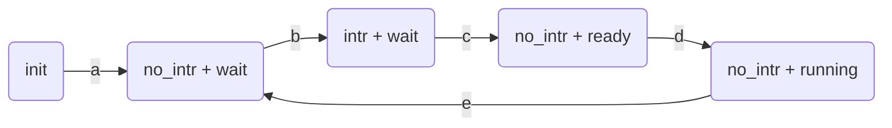

### CPU、网卡与 `ATSINTC` 不协调

对于由于外设而阻塞的任务，需要 CPU 参与，把阻塞任务注册到 `ATSINTC` 中

注册阻塞任务需要两个步骤，无论这两者的顺序，都存在不协调的问题

- 写网卡对应的中断状态寄存器，把中断信号拉低
- 获取当前的任务，并将其添加到 `ATSINTC` 的阻塞队列中

两种顺序：

1. 先清中断，再添加阻塞任务
2. 添加阻塞任务，再清理中断

这两种方案，在中间的过程，网卡收到了包之后，都不能唤醒阻塞的任务。对于顺序 1，清理中断后，中断信号能被拉高，但由于阻塞队列中没有任务，因此唤醒不了；对于顺序 2，添加阻塞任务，这时收到了包，但没有清理中断，在清理掉中断后，中断信号也不会拉高，因此也唤醒不了阻塞任务

导致这个问题的原因：唤醒操作只能通过中断信号的上升沿才会触发，以上两种顺序，都是因为中断请求被丢掉了，无法唤醒

由于之前的测试，是直接通过以太网数据包进行的，PC 下一次发送必须在收到板子的包之后才能进行，存在严格的顺序，因此在 PC 在发送之前，ATSINTC 的状态一定处于 `intr + bq` 状态，因此这个错误对于之前的测试结果没有影响。而协议栈中的 ping 也是一发一收，也不会受到影响。

当加入 TCP 连接后，由于每次传输数据不是严格按照一发一收进行（一次传输可能需要三次），就会存在上述问题。当板子收到包后，发送了 ACK，这时判断没有数据包，走上述添加阻塞任务的过程，在过程中，PC 也发送了下一个包，就会出现上述情况。

解决方案的简单描述：中断请求可以丢掉，但必须有补救措施

### 解决方案

由于唤醒机制设计不完善导致的不协调，必须在硬件上修改，不需要软件提供补救措施。

目前的唤醒机制只是单方面根据中断信号的上升沿进行，与 `ATSINTC` 的阻塞队列相联系（匹配）。中断信号上升沿与 CPU 清除网卡中断状态寄存器相关，阻塞队列与 CPU 添加阻塞任务相关。

#### 中断控制器中的状态转换图

#### 状态

init: 表示中断控制器处于初始状态

`no_intr` / `intr`：有无中断请求，它与中断控制器中维护的状态寄存器相关，与外设中断线上的信号电平高低或脉冲沿不直接相关。

`wait` /` ready` / `running`：协程状态
- `wait`：协程处于控制器的阻塞队列中
- `ready`：协程处于控制器的就绪队列中
- `running`：控制器的阻塞队列和就绪队列中均没有协程的标识信息（需要额外增加寄存器维护正在运行的协程信息）

#### 状态转换

中断控制器中的结构：中断门 gateway（参考 plic 的设计）、阻塞队列、就绪队列

中断门有两种状态：
1. 打开（可以接收中断信号）：打开状态，只要中断信号处于高电平，且阻塞队列中有阻塞任务（任务处于阻塞状态），中断控制器会进行中断处理
2. 关闭（中断信号被屏蔽）：无论中断信号怎么变化或处于高低电平，中断控制器都不会进行中断处理

初始状态：每个中断信号的中断门处于关闭状态

- a：CPU 写对应的 IO 端口，注册阻塞协程（将阻塞协程放到中断控制器的阻塞队列中），并把中断门打开
- b: 外设的中断信号线为高电平
- c：中断控制器将协程从阻塞队列移到就绪队列中，关闭中断门
- d：CPU 从中断控制器的就绪队列中拿到任务，协程进入运行状态，中断门处于关闭状态
- e：CPU 先清除外设对应的中断状态寄存器，把中断信号电平拉低，后续操作与 a 的过程相同，CPU 写 IO 端口，注册阻塞协程，打开中断门