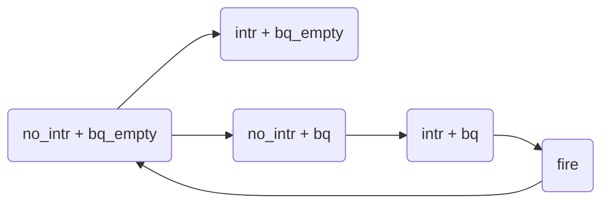
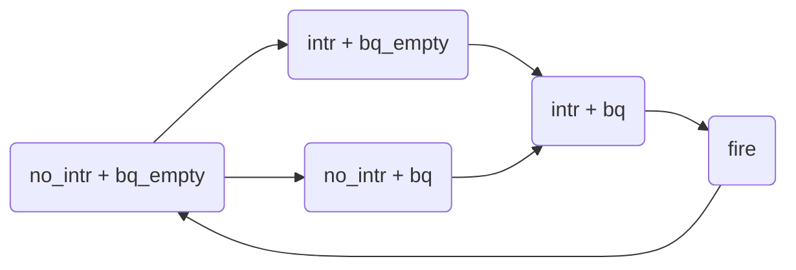

### CPU、网卡与 `ATSINTC` 不协调

对于由于外设而阻塞的任务，需要 CPU 参与，把阻塞任务注册到 `ATSINTC` 中

注册阻塞任务需要两个步骤，无论这两者的顺序，都存在不协调的问题

- 写网卡对应的中断状态寄存器，把中断信号拉低
- 获取当前的任务，并将其添加到 `ATSINTC` 的阻塞队列中

两种顺序：

1. 先清中断，再添加阻塞任务
2. 添加阻塞任务，再清理中断

这两种方案，在中间的过程，网卡收到了包之后，都不能唤醒阻塞的任务。对于顺序 1，清理中断后，中断信号能被拉高，但由于阻塞队列中没有任务，因此唤醒不了；对于顺序 2，添加阻塞任务，这时收到了包，但没有清理中断，在清理掉中断后，中断信号也不会拉高，因此也唤醒不了阻塞任务

导致这个问题的原因：唤醒操作只能通过中断信号的上升沿才会触发

画出的状态图如下：

以上两种顺序，都是因为中断请求被丢掉了，无法唤醒

解决方案的简单描述：中断请求可以丢掉，但必须有补救措施

### 解决方案

由于唤醒机制设计不完善导致的不协调，必须在硬件上修改，不需要软件提供补救措施。

目前的唤醒机制只是单方面根据中断信号的上升沿进行，与 `ATSINTC` 的阻塞队列相联系（匹配）。中断信号上升沿与 CPU 清除网卡中断状态寄存器相关，阻塞队列与 CPU 添加阻塞任务相关。

触发机制：

当中断信号被拉高后，只要阻塞队列中有任务，即可唤醒。限制了必须采用顺序 1，先清理中断，再添加阻塞任务。

需要对唤醒机制的状态图进行详细描述。

