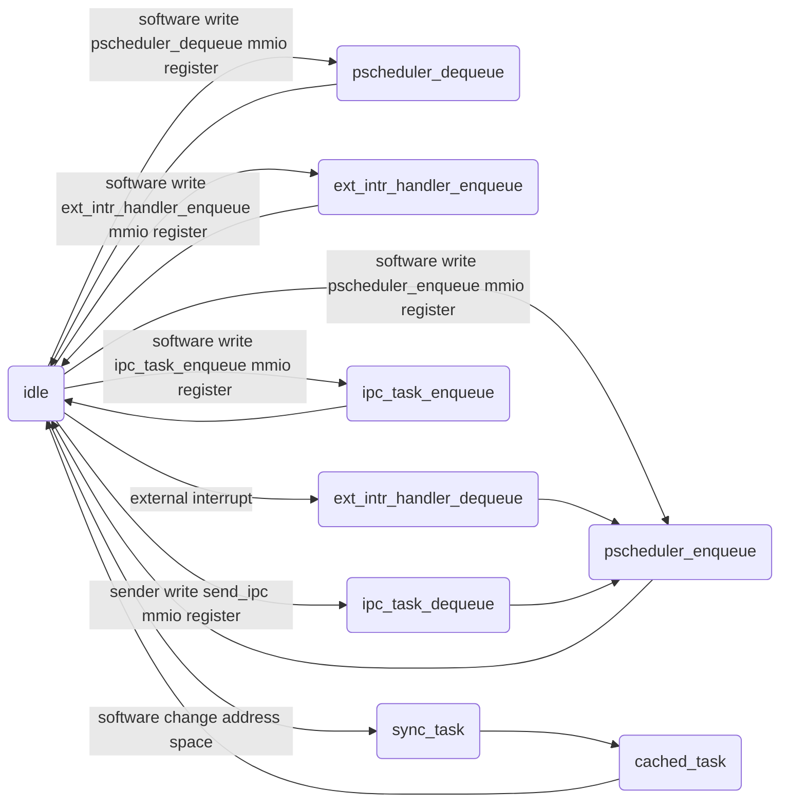

## Basic functions

```mermaid
flowchart LR
    A(idle)
    B(pscheduler_enqueue)
    C(pscheduler_dequeue)
    D(ext_intr_handler_enqueue)
    E(ext_intr_handler_dequeue)
    F(ipc_task_enqueue)
    G(ipc_task_dequeue)
    H(cached_task)
    I(sync_task)

    A --> |software write pscheduler_enqueue mmio register| B --> A
    A --> |software write pscheduler_dequeue mmio register| C --> A
    A --> |software write ext_intr_handler_enqueue mmio register| D --> A
    A --> |external interrupt| E --> B
    A --> |software write ipc_task_enqueue mmio register| F --> A
    A --> |sender write send_ipc mmio register| G --> B
    A --> |software change address space| I --> H --> A
```