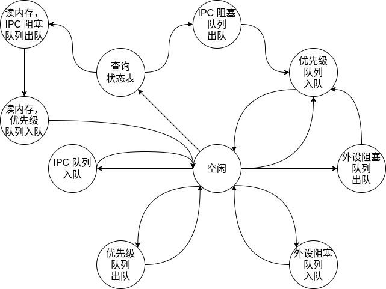

# 功能：

## 1. 基本的调度器功能

软件主导，硬件配合，控制器中维护优先级队列

1. 任务入队
2. 任务出队

## 2. 处理外部中断

硬件主导，软件起头

1. 软件将中断处理例程添加到控制器对应外设的阻塞队列中
2. 控制器收到外部中断信号后，根据中断向量号从对应的外设阻塞队列中取出中断处理例程
3. 将中断处理例程添加到优先级队列中

## 3. 处理 IPC

软件起头，硬件主导

1. 接收方注册，通过写 MMIO 寄存器，将接受方的 IPC 处理例程添加到控制器维护的对应进程的 IPC 阻塞队列中（接收方肯定在线）
2. 发送方先在共享内存中创建 IPC 消息条目，通过写 MMIO 寄存器发起 IPC
   1. 控制器查找进程状态表，确定接受方是否在线，若在线，则控制器从接收方的 IPC 阻塞队列中取出 IPC 处理例程；若不在线，则从内存中的 IPC 阻塞队列中取出 IPC 处理例程，再写到内存中维护的接收方优先级队列
   2. 发送方将发送协程添加到 IPC 阻塞队列中（若不需要发送响应，可省略）
3. 接收方 IPC 处理，IPC 处理例程从共享内存中获取 IPC 消息，处理完毕后，返回响应（同上述 2 的步骤）

## 4. 进程切换

软件主导，硬件配合，控制器维护全局进程状态表

1. 将控制器中当前进程的任务同步到内存中（优先级队列、IPC 阻塞队列）
2. 从内存中读出目标进程的任务（优先级队列、IPC 阻塞队列）

## 5. 大规模（数量）任务内存缓存机制（可选项）

需要进一步设计优先级队列的格式，尽可能减少内存读写次数。如果采用这种方式，则干脆将所有的任务都在内存中维护。

需要将控制器连接到内存中，目前具体的实现还需要进一步阅读 chipyard 文档。

